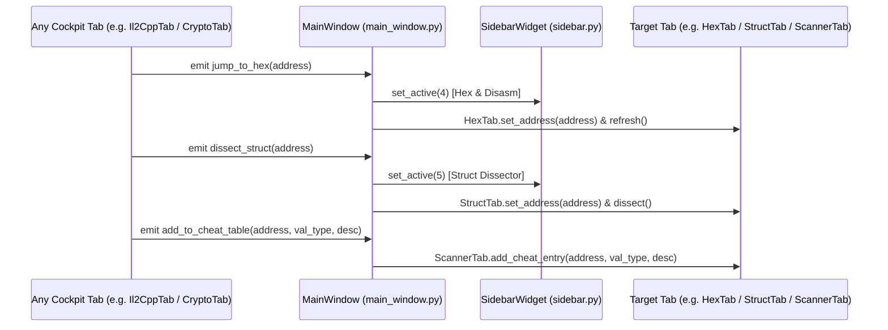

# PhantomSuite // AI Agent Architectural Handoff & Continuity Guide

> **Target Audience:** Autonomous AI coding agents (Claude, GPT, Antigravity, etc.) tasked with maintaining, hardening, extending, or refactoring PhantomSuite.  
> **Status:** Production-ready Linux Reverse Engineering & Process Workbench (17 Cockpit Tabs, 31 Core Engines, 132/132 Passing Automated Tests).  
> **Repository Root:** `/home/eve/Projects/PhantomSuite`

---

## 1. Executive Summary & Project Vision

PhantomSuite is a cyberpunk-themed, high-performance Linux desktop workbench combining the capabilities of **Cheat Engine**, **Process Hacker**, **ReClass.NET**, **x64dbg**, and **Glory Injector** into a unified, native **PySide6 (Qt6)** interface.

### Architectural Philosophy
1. **Linux-Native Performance:** Replaces slow GDB wrappers and cross-platform abstractions with direct Linux kernel syscalls (`process_vm_readv`, `process_vm_writev`), `/proc/<pid>/` introspection, and zero-latency `/dev/shm` shared memory IPC.
2. **Wayland & Hyprland First-Class:** Full Hyprland IPC integration (`hyprctl activewindow -j`, `hyprctl clients -j`) with automatic window detection alongside standard X11 compatibility.
3. **Low-Level Rigor:** Built with deep systems programming principles—handling ASLR rebasing, x86_64 hardware debug registers (`DR0-DR3`), glibc ptmalloc heap internals, DWARF debug metadata, Z3 SMT constraint solving, and Unity IL2CPP runtime klass layouts.
4. **Ergonomic Cockpit:** 17 specialized tools organized within a collapsible left navigation sidebar (`Ctrl+B`), unified fuzzy Command Palette (`Ctrl+K`), and a persistent situational-awareness header bar.

---

## 2. User Context & Engineering Invariants

The repository owner is a **Senior Low-Level Windows/Linux Security Researcher, Hypervisor Developer, and Adversarial-ML Red-Teamer**.

When writing code or making design decisions in this codebase, **always uphold these invariants**:
* **Senior-Engineer Quality First:** Deliver deep, architecturally robust solutions. Avoid superficial quick-fixes or "first-thing-that-works" hacks.
* **Max Effort & Rigor:** Write clean, typed, documented, exception-safe code with complete edge-case handling.
* **Terse, Dense Communication:** When interacting with the user, prioritize concise, technical summaries over verbose chatter.
* **Strict Test Pass Rate:** Never break existing functionality. The test suite must remain at 100% pass rate (`132/132 tests`).

---

## 3. High-Level Architecture

```mermaid
flowchart TD
    subgraph TargetProcess ["Target Process (Linux x86_64)"]
        VAS["Virtual Address Space (/proc/[pid]/maps)"]
        Heap["glibc ptmalloc Heap / Bins"]
        IL2CPP["Unity IL2CPP Runtime (Klass / Objects)"]
        Threads["Threads & Tasks (/proc/[pid]/task)"]
        Sockets["File Descriptors & Sockets (/proc/[pid]/fd)"]
        SpeedSo["speedhack.so (/dev/shm IPC)"]
    end

    subgraph Kernel ["Linux Kernel Subsystem"]
        VMCalls["process_vm_readv / writev"]
        Ptrace["ptrace / Hardware Debug Registers DR0-DR3"]
        ProcFS["/proc Introspection & Net /proc/net/tcp"]
    end

    subgraph CoreEngine ["PhantomSuite Core Subsystem (phantom_suite/core/)"]
        MemEngine["memory_engine.py"]
        SnapEngine["snapshot_engine.py"]
        HexDisasm["hex_viewer.py & disassembler.py"]
        StructEngine["struct_dissector.py & dwarf_synthesizer.py"]
        SymEngine["symbolic_solver.py (Z3)"]
        Il2CppEngine["il2cpp_inspector.py"]
        MicroEmu["micro_emulator.py (x86_64 CPU State)"]
        CryptoScan["entropy_crypto_scanner.py (Shannon & Constants)"]
        HeapEngine["heap_inspector.py (ptmalloc)"]
        CFGEngine["cfg_engine.py (Basic Block DAG)"]
        PMUEngine["pmu_profiler.py (RDTSC / Anti-Debug)"]
        DetourEngine["detour_engine.py (Trampoline Hooks)"]
        ScriptEngine["script_engine.py (Hybrid Exec/Eval REPL)"]
        SocketStream["socket_stream_interceptor.py"]
        CoreGdb["core_dump_gdb_bridge.py"]
    end

    subgraph CockpitUI ["PhantomSuite UI Cockpit (phantom_suite/ui/)"]
        MainShell["main_window.py (Top Header, Status Bar, Tab Stack)"]
        Sidebar["sidebar.py (Collapsible 210px / 54px Rail)"]
        Palette["command_palette.py (Ctrl+K Fuzzy Launcher & Jump)"]
        TabStack["17 Cockpit Tabs (Welcome, Scanner, Hex, Structs, IL2CPP, Emulator, Crypto...)"]
        Dialogs["Specialized Dialogs (CFG, Heap, PMU, Watchpoints, Pointer Scanner, HUD)"]
    end

    TargetProcess <--> Kernel
    Kernel <--> CoreEngine
    CoreEngine <--> CockpitUI
```



---

## 4. Directory & Subsystem Inventory

### 4.1. Core Engines (`phantom_suite/core/`)

| File | Purpose & Responsibilities | Key Classes / Functions |
| :--- | :--- | :--- |
| [`memory_engine.py`](file:///home/eve/Projects/PhantomSuite/phantom_suite/core/memory_engine.py) | High-speed memory read/write via `process_vm_readv`/`writev`, multi-type scan engine, active freezer worker | `MemoryScanner`, `ScanConstraint`, `ValueFreezer` |
| [`snapshot_engine.py`](file:///home/eve/Projects/PhantomSuite/phantom_suite/core/snapshot_engine.py) | Full-process writable memory capture (`rw-p`), multi-format delta comparison, noise filter | `SnapshotEngine`, `MemorySnapshot` |
| [`hex_viewer.py`](file:///home/eve/Projects/PhantomSuite/phantom_suite/core/hex_viewer.py) | Memory hex dumping, formatting, in-place byte patching | `HexViewerEngine` |
| [`disassembler.py`](file:///home/eve/Projects/PhantomSuite/phantom_suite/core/disassembler.py) | Live x86_64 disassembly (Capstone), 1-click NOP patcher (`0x90`), patch restoration | `DisassemblerEngine`, `DisassembledInstruction` |
| [`pattern_scanner.py`](file:///home/eve/Projects/PhantomSuite/phantom_suite/core/pattern_scanner.py) | Byte array pattern matching (`??` / `*` wildcards), automated unique SigMaker | `PatternScanner`, `SigMaker` |
| [`pointer_scanner.py`](file:///home/eve/Projects/PhantomSuite/phantom_suite/core/pointer_scanner.py) | Multi-level pointer path crawling across heap/data segments | `PointerScannerEngine`, `PointerScanPath` |
| [`struct_dissector.py`](file:///home/eve/Projects/PhantomSuite/phantom_suite/core/struct_dissector.py) | Live struct dissection, heuristic type detection (pointers, floats, ASCII), heatmaps, C header export | `StructDissectorEngine`, `DissectedMember` |
| [`dwarf_synthesizer.py`](file:///home/eve/Projects/PhantomSuite/phantom_suite/core/dwarf_synthesizer.py) | DWARF `.debug_info` / `.debug_types` extractor, synthesized C struct definitions from binaries | `DwarfSynthesizer`, `DwarfStructDefinition` |
| [`cfg_engine.py`](file:///home/eve/Projects/PhantomSuite/phantom_suite/core/cfg_engine.py) | Control Flow Graph generator, basic block DAG construction, conditional jump inversion (`JE` $\leftrightarrow$ `JNE`) | `CFGEngine`, `BasicBlock`, `CFGGraph` |
| [`heap_inspector.py`](file:///home/eve/Projects/PhantomSuite/phantom_suite/core/heap_inspector.py) | Glibc ptmalloc arena chunk walker, tcache / fastbin inspection, double-free auditor | `HeapInspector`, `HeapChunk`, `MallocState` |
| [`detour_engine.py`](file:///home/eve/Projects/PhantomSuite/phantom_suite/core/detour_engine.py) | Mid-function detour hook engine, instruction length decoding, relocation trampolines | `DetourEngine`, `DetourHook` |
| [`pmu_profiler.py`](file:///home/eve/Projects/PhantomSuite/phantom_suite/core/pmu_profiler.py) | RDTSC & PMU hardware execution timing delta analysis, anti-debug heuristic scanner | `PmuProfiler`, `AntiDebugAuditResult` |
| [`symbolic_solver.py`](file:///home/eve/Projects/PhantomSuite/phantom_suite/core/symbolic_solver.py) | Z3 SMT symbolic path solver, memory offset constraint verification | `SymbolicSolverEngine` |
| [`il2cpp_inspector.py`](file:///home/eve/Projects/PhantomSuite/phantom_suite/core/il2cpp_inspector.py) | In-memory Unity IL2CPP runtime metadata extractor (`Il2CppClass`, fields, VTable), C#/C++20 layout generator | `Il2CppInspector`, `Il2CppClassInfo`, `Il2CppFieldInfo` |
| [`micro_emulator.py`](file:///home/eve/Projects/PhantomSuite/phantom_suite/core/micro_emulator.py) | Sandboxed x86_64 CPU state emulator, shadow paging (COW), step/call/ret, snapshot undo stack | `MicroEmulator`, `CpuRegisters`, `ShadowMemory` |
| [`entropy_crypto_scanner.py`](file:///home/eve/Projects/PhantomSuite/phantom_suite/core/entropy_crypto_scanner.py) | Shannon entropy calculation ($H \in [0.0, 8.0]$ bits/byte), cryptographic constant matcher (AES, SHA, ChaCha20, etc.) | `EntropyCryptoScanner`, `CryptoMatch`, `EntropyBlock` |
| [`socket_stream_interceptor.py`](file:///home/eve/Projects/PhantomSuite/phantom_suite/core/socket_stream_interceptor.py) | Process socket descriptor correlation with `/proc/net/tcp` and real-time stream packet inspection | `SocketStreamInterceptor`, `SocketConnection` |
| [`core_dump_gdb_bridge.py`](file:///home/eve/Projects/PhantomSuite/phantom_suite/core/core_dump_gdb_bridge.py) | ELF64 core dump reader, `PT_NOTE`/`PT_LOAD` segment extractor, GDB/MI post-mortem bridge | `CoreDumpReader`, `GdbMiBridge` |
| [`script_engine.py`](file:///home/eve/Projects/PhantomSuite/phantom_suite/core/script_engine.py) | Python AST hybrid exec/eval engine, pre-injected memory automation APIs, plugin manager | `ScriptEngine`, `PluginManager` |
| [`elf_explorer.py`](file:///home/eve/Projects/PhantomSuite/phantom_suite/core/elf_explorer.py) | ELF `.symtab` / `.dynsym` parser with C++ demangling (`c++filt` / `readelf`), section mapping | `ElfExplorer`, `ElfSymbol` |
| [`process_manager.py`](file:///home/eve/Projects/PhantomSuite/phantom_suite/core/process_manager.py) | `/proc` process enumerator, Hyprland Wayland IPC client, `SIGSTOP`/`SIGCONT`/`SIGKILL` signals | `ProcessManager`, `ProcessInfo` |
| [`thread_manager.py`](file:///home/eve/Projects/PhantomSuite/phantom_suite/core/thread_manager.py) | `/proc/<pid>/task` thread explorer, per-thread pause/resume (`tgkill`), CPU affinity pinning | `ThreadManager`, `ThreadInfo` |
| [`handle_tracer.py`](file:///home/eve/Projects/PhantomSuite/phantom_suite/core/handle_tracer.py) | `/proc/<pid>/fd` file descriptor enumerator, socket/pipe/file resolution | `HandleTracer`, `FdHandle` |
| [`injector.py`](file:///home/eve/Projects/PhantomSuite/phantom_suite/core/injector.py) | GDB `dlopen` shared library injection, `/proc/<pid>/maps` verification, `dlclose` unloader | `Injector` |
| [`speedhack_controller.py`](file:///home/eve/Projects/PhantomSuite/phantom_suite/core/speedhack_controller.py) | Injected `/dev/shm` IPC shared-memory speedhack controller (time dilation `0.2x` to `5.0x`) | `SpeedhackController` |
| [`watchpoint_tracer.py`](file:///home/eve/Projects/PhantomSuite/phantom_suite/core/watchpoint_tracer.py) | Hardware debug registers (`DR0-DR3`) tracer via GDB batch mode ("Find What Writes/Accesses") | `WatchpointTracer`, `WatchpointHit` |
| [`memory_map.py`](file:///home/eve/Projects/PhantomSuite/phantom_suite/core/memory_map.py) | Virtual memory address space treemap, segment categorization, KPI aggregation | `MemoryMapAnalyzer`, `MemorySegment` |
| [`syscall_tracer.py`](file:///home/eve/Projects/PhantomSuite/phantom_suite/core/syscall_tracer.py) | Real-time `strace` streaming telemetry, category color-coding (`FILE`, `NET`, `MEM`, etc.) | `SyscallTracer`, `SyscallEvent` |
| [`data_deserializer.py`](file:///home/eve/Projects/PhantomSuite/phantom_suite/core/data_deserializer.py) | C++ `std::string` (SSO vs heap), `std::vector`, embedded JSON scanner, string tables | `DataDeserializer` |
| [`recent_targets.py`](file:///home/eve/Projects/PhantomSuite/phantom_suite/core/recent_targets.py) | Target history persistence (`~/.config/phantom-suite/recent_targets.json`) | `RecentTargetsManager`, `RecentTarget` |
| [`table_serializer.py`](file:///home/eve/Projects/PhantomSuite/phantom_suite/core/table_serializer.py) | ASLR-resilient `.phantom` JSON cheat table serialization and module-relative offset rebasing | `TableSerializer`, `CheatEntry` |

---

### 4.2. UI Cockpit & Tabs (`phantom_suite/ui/`)

The workbench shell maintains **17 indexed tabs** within `self.tab_stack` in [`main_window.py`](file:///home/eve/Projects/PhantomSuite/phantom_suite/ui/main_window.py):

| Index | Tab Widget | File | Superpower / Purpose | Cross-Tab Signals |
| :---: | :--- | :--- | :--- | :--- |
| `0` | `WelcomeTab` | [`welcome_tab.py`](file:///home/eve/Projects/PhantomSuite/phantom_suite/ui/welcome_tab.py) | Mission Control launcher, quick attach, recent target history | `attach_pid`, `open_tool` |
| `1` | `ProcessTab` | [`process_tab.py`](file:///home/eve/Projects/PhantomSuite/phantom_suite/ui/process_tab.py) | Process list, Hyprland window filter, attach & signal controls | `attach_pid` |
| `2` | `ScannerTab` | [`scanner_tab.py`](file:///home/eve/Projects/PhantomSuite/phantom_suite/ui/scanner_tab.py) | Memory scanner, Fast Scan, active freezer, Cheat Table, `.phantom` files | `jump_to_hex`, `dissect_struct` |
| `3` | `SnapshotTab` | [`snapshot_tab.py`](file:///home/eve/Projects/PhantomSuite/phantom_suite/ui/snapshot_tab.py) | Full-process snapshot diff (Snap A vs Snap B), delta export | `add_to_cheat_table`, `jump_to_hex` |
| `4` | `HexTab` | [`hex_tab.py`](file:///home/eve/Projects/PhantomSuite/phantom_suite/ui/hex_tab.py) | Real-time hex editor (500ms auto-refresh), live disassembler, SigMaker, NOP patcher | `add_to_cheat_table`, `dissect_struct` |
| `5` | `StructTab` | [`struct_tab.py`](file:///home/eve/Projects/PhantomSuite/phantom_suite/ui/struct_tab.py) | Interactive struct dissector, heuristic pointer/float detection, live heatmaps, C header export | `add_to_cheat_table`, `jump_to_hex` |
| `6` | `SymbolsTab` | [`symbols_tab.py`](file:///home/eve/Projects/PhantomSuite/phantom_suite/ui/symbols_tab.py) | ELF `.symtab`/`.dynsym` symbol explorer, C++ demangling, runtime address calculation | `jump_to_hex`, `add_to_cheat_table` |
| `7` | `TreemapTab` | [`treemap_tab.py`](file:///home/eve/Projects/PhantomSuite/phantom_suite/ui/treemap_tab.py) | Virtual memory address space proportional bar, segment KPI cards | `jump_to_hex`, `dissect_struct` |
| `8` | `SyscallsTab` | [`syscalls_tab.py`](file:///home/eve/Projects/PhantomSuite/phantom_suite/ui/syscalls_tab.py) | Real-time GUI `strace` telemetry monitor, category highlights, CSV export | — |
| `9` | `ConsoleTab` | [`console_tab.py`](file:///home/eve/Projects/PhantomSuite/phantom_suite/ui/console_tab.py) | Embedded Python scripting console, hybrid exec/eval REPL, memory helper APIs | — |
| `10` | `DeserializerTab` | [`deserializer_tab.py`](file:///home/eve/Projects/PhantomSuite/phantom_suite/ui/deserializer_tab.py) | C++ `std::string` / `std::vector` parser, raw JSON scanner, C-string extractor | `add_to_cheat_table`, `jump_to_hex` |
| `11` | `InjectorTab` | [`injector_tab.py`](file:///home/eve/Projects/PhantomSuite/phantom_suite/ui/injector_tab.py) | Shared library (`.so`) GDB injection, module explorer, `dlclose` unloader | — |
| `12` | `ThreadsTab` | [`threads_tab.py`](file:///home/eve/Projects/PhantomSuite/phantom_suite/ui/threads_tab.py) | Thread task explorer (`/proc/<pid>/task`), per-thread pause/resume, CPU core affinity | — |
| `13` | `HandlesTab` | [`handles_tab.py`](file:///home/eve/Projects/PhantomSuite/phantom_suite/ui/handles_tab.py) | Open file descriptors, TCP/UDP socket resolution (`ESTABLISHED`, `LISTEN`) | — |
| `14` | `Il2CppTab` | [`il2cpp_tab.py`](file:///home/eve/Projects/PhantomSuite/phantom_suite/ui/il2cpp_tab.py) | Live Unity IL2CPP runtime klass introspector, field offsets, C#/C++20 struct generator | `jump_to_hex`, `dissect_struct`, `add_to_cheat_table` |
| `15` | `MicroEmulatorTab` | [`micro_emulator_tab.py`](file:///home/eve/Projects/PhantomSuite/phantom_suite/ui/micro_emulator_tab.py) | Sandboxed x86_64 CPU state emulator, shadow paging, delta register view, snapshot rollbacks | `jump_to_hex` |
| `16` | `CryptoTab` | [`crypto_tab.py`](file:///home/eve/Projects/PhantomSuite/phantom_suite/ui/crypto_tab.py) | Shannon entropy spectrum analyzer ($H \in [0, 8]$), cryptographic constant matcher | `jump_to_hex`, `add_to_cheat_table` |

---

### 4.3. Cockpit Dialogs & Overlays

* **[`cfg_dialog.py`](file:///home/eve/Projects/PhantomSuite/phantom_suite/ui/cfg_dialog.py) (`CFGVisualizerDialog`):** Interactive Control Flow Graph basic block visualizer with conditional jump inversion.
* **[`heap_dialog.py`](file:///home/eve/Projects/PhantomSuite/phantom_suite/ui/heap_dialog.py) (`HeapInspectorDialog`):** Glibc ptmalloc heap arena chunks, tcache bins, and fastbin corruption auditor.
* **[`pmu_dialog.py`](file:///home/eve/Projects/PhantomSuite/phantom_suite/ui/pmu_dialog.py) (`PmuProfilerDialog`):** RDTSC instruction timing delta visualizer and anti-debug trap auditor.
* **[`pointer_dialog.py`](file:///home/eve/Projects/PhantomSuite/phantom_suite/ui/pointer_dialog.py) (`PointerScannerDialog`):** Multi-level pointer path crawler dialog with direct cheat table export.
* **[`watchpoint_dialog.py`](file:///home/eve/Projects/PhantomSuite/phantom_suite/ui/watchpoint_dialog.py) (`WatchpointDialog`):** Hardware debug register (`DR0-DR3`) tracer with 1-click NOP patching.
* **[`osd_overlay.py`](file:///home/eve/Projects/PhantomSuite/phantom_suite/ui/osd_overlay.py) (`OSDOverlay`):** Translucent, draggable Wayland/X11 floating HUD displaying pinned cheat table values and speedhack status.
* **[`shortcuts_dialog.py`](file:///home/eve/Projects/PhantomSuite/phantom_suite/ui/shortcuts_dialog.py) (`ShortcutsDialog`):** Interactive hotkey cheat sheet (`F1` or `?`).

---

## 5. Critical Engineering Invariants & Pitfalls

### ⚠️ Pitfall 1: 64-Bit Pointer Truncation in PySide6 Signals
* **The Root Cause:** In PySide6 / Shiboken bindings, `Signal(int)` binds to a C++ 32-bit signed integer (`int32_t`), which has a maximum value of `0x7FFFFFFF` ($2^{31}-1 \approx 2.14 \times 10^9$).
* **The Symptom:** Emitting standard 64-bit user space pointers (such as `0x5555...` or `0x7fff...`) via `Signal(int)` causes:
  ```python
  OverflowError: Python int too large to convert to C long
  # or
  RuntimeWarning: libshiboken: Overflow: ...
  ```
* **THE INVARIANT:** **ALWAYS** declare address-carrying Qt signals with `Signal(object)`:
  ```python
  # CORRECT:
  jump_to_hex = Signal(object)
  dissect_struct = Signal(object)
  add_to_cheat_table = Signal(object, str, str)  # (address, val_type, desc)

  # WRONG - DO NOT DO THIS:
  jump_to_hex = Signal(int)  # WILL CRASH ON 64-BIT ADDRESSES
  ```

### ⚠️ Pitfall 2: Cheat Table Signal Parameter Ordering
* The cheat table insertion method in [`ScannerTab`](file:///home/eve/Projects/PhantomSuite/phantom_suite/ui/scanner_tab.py) is:
  ```python
  def add_cheat_entry(self, address: int, val_type: str = "int32", desc: str = ""):
  ```
* **THE INVARIANT:** Any UI tab emitting `add_to_cheat_table` must emit parameters in exact order `(address, val_type, desc)`.

### ⚠️ Pitfall 3: Headless Qt Testing Initialization
* Running `unittest` in headless Linux terminal environments, CI/CD runners, or subagents will fail with `qt.qpa.xcb: could not connect to display` if Qt is not initialized with the `offscreen` platform plugin.
* **THE INVARIANT:** In all UI unit tests, initialize the test application as:
  ```python
  from PySide6.QtWidgets import QApplication

  @classmethod
  def setUpClass(cls):
      cls.app = QApplication.instance() or QApplication(["-platform", "offscreen"])
  ```

### ⚠️ Pitfall 4: Non-Blocking GUI & Thread Safety
* Never perform blocking memory scanning, pointer crawling, GDB sessions, or micro-emulation loops directly on the Qt main thread.
* **THE INVARIANT:** Always offload intensive loops into `QThread` workers or daemon background threads. Communicate results back to UI widgets exclusively via Qt Signals (e.g. `scan_progress`, `scan_finished`). Do not manipulate Qt widgets across thread boundaries directly.

### ⚠️ Pitfall 5: Linux Permissions (`ptrace_scope`)
* Direct syscall memory access via `process_vm_readv` requires either matching effective UID or `CAP_SYS_PTRACE`.
* Check `/proc/sys/kernel/yama/ptrace_scope`:
  * `0`: Unrestricted access to user processes (ideal for modding & RE).
  * `1`: Restricted to parent processes (`PR_SET_PTRACER`). Requires fallback to `/proc/<pid>/mem` or `pkexec` elevation.

### ⚠️ Pitfall 6: Python Console AST Hybrid Parsing
* In [`script_engine.py`](file:///home/eve/Projects/PhantomSuite/phantom_suite/core/script_engine.py), code is executed through an AST splitter:
  * Multi-line statements are compiled with `exec()`.
  * The final statement, if it is an expression (`ast.Expr`), is compiled with `eval()` so its return value is printed cleanly in the REPL.
  * Local variables must persist across execution sessions via `self._locals`.

---

## 6. Cross-Tab Signal & Navigation Architecture

All cross-tab routing is coordinated centrally in [`MainWindow`](file:///home/eve/Projects/PhantomSuite/phantom_suite/ui/main_window.py):



### Adding Routing to a New Tab
When creating a new cockpit tab that needs cross-tab navigation:
1. Define the signals on the tab class:
   ```python
   jump_to_hex = Signal(object)
   dissect_struct = Signal(object)
   add_to_cheat_table = Signal(object, str, str)
   ```
2. In `MainWindow._init_ui()` in [`main_window.py`](file:///home/eve/Projects/PhantomSuite/phantom_suite/ui/main_window.py), connect the signals:
   ```python
   self.new_tab.jump_to_hex.connect(self._jump_to_hex)
   self.new_tab.dissect_struct.connect(self._dissect_struct)
   self.new_tab.add_to_cheat_table.connect(self.scanner_tab.add_cheat_entry)
   ```
3. Add the tab index entry in [`sidebar.py`](file:///home/eve/Projects/PhantomSuite/phantom_suite/ui/sidebar.py).
4. Register the tab navigation action in [`command_palette.py`](file:///home/eve/Projects/PhantomSuite/phantom_suite/ui/command_palette.py).

---

## 7. Command Palette & Address Routing (`Ctrl+K`)

The fuzzy Command Palette (`command_palette.py`) serves two functions:
1. **Fuzzy Action Launcher:** Typing keywords like `scan`, `hex`, `proc`, `speed`, `snap`, `hud`, `heap`, `cfg` executes registered actions.
2. **Direct Address Routing:** If the input text matches a hex address pattern (e.g. `0x55AFC0A4A080` or `55AFC...`) or decimal integer:
   * Dynamically injects two contextual actions at top of results:
     * `🧬 Jump to Hex Editor at 0x...` $\rightarrow$ triggers `_jump_to_hex(addr)`
     * `🔬 Dissect Struct at 0x...` $\rightarrow$ triggers `_dissect_struct(addr)`

When extending the Command Palette, register new actions inside `MainWindow._build_palette_actions()`.

---

## 8. Verification & Test Suite Protocol

The test suite is located in `/home/eve/Projects/PhantomSuite/tests/` and contains **132 comprehensive tests**.

### Running the Test Suite
Always verify before and after making any modifications:

```bash
cd /home/eve/Projects/PhantomSuite
python3 -m unittest discover tests/
```

Expected output:
```text
Ran 132 tests in 5.2s

OK
```

### Test Suite Structure
* `test_visual_tabs.py`: Tests for Tabs 14 (`Il2CppTab`), 15 (`MicroEmulatorTab`), 16 (`CryptoTab`), including 64-bit signal safety.
* `test_il2cpp_inspector.py`: Unity IL2CPP klass introspection, field resolution, C#/C++20 struct generation.
* `test_micro_emulator.py`: x86_64 emulation, lazy paging, register delta tracking, snapshot rollback.
* `test_entropy_crypto_scanner.py`: Shannon entropy calculation, AES/SHA/ChaCha20 magic constant database.
* `test_socket_stream_interceptor.py`: Socket inode mapping, protocol decoding.
* `test_core_dump_gdb_bridge.py`: ELF64 coredump reader, PT_LOAD segments, GDB/MI bridge.
* `test_script_engine.py`: Hybrid AST exec/eval, variable persistence, pre-injected memory APIs.
* `test_memory_engine.py`: `process_vm_readv`/`writev`, multi-type scan filters, value freezer.
* `test_snapshot_engine.py`: Memory snapshots, differential delta comparison.
* `test_disassembler.py`: Capstone disassembly, NOP patching, undo restoration.
* `test_pattern_scanner.py`: AOB wildcards, SigMaker signature generator.
* `test_struct_dissector.py`: Heuristic type inferer, heatmaps, C header export.
* `test_dwarf_synthesizer.py`: DWARF debug info parsing, C struct synthesis.
* `test_cfg_engine.py`: Control Flow Graph basic block DAG, conditional jump inversion.
* `test_heap_inspector.py`: Glibc ptmalloc heap chunks, tcache, fastbin double-free auditing.
* `test_detour_engine.py`: Mid-function trampoline hooks, relocation assembly.
* `test_pmu_profiler.py`: RDTSC execution timing delta, anti-debug heuristic tests.
* `test_symbolic_solver.py`: Z3 SMT constraint solving.
* `test_sidebar.py` & `test_command_palette.py`: Navigation, collapsing, fuzzy filtering, address jumping.

---

## 9. Developer Playbooks

### Playbook A: Adding a New Core Engine
1. Create `phantom_suite/core/<engine_name>.py`.
2. Implement clean dataclasses for result types and a well-encapsulated engine class.
3. Handle failure modes gracefully (unreadable memory, missing files, null pointers, negative PIDs).
4. Export the engine class in `phantom_suite/core/__init__.py`.
5. Expose helper functions in `phantom_suite/core/script_engine.py` if automation is appropriate.
6. Write unit tests in `tests/test_<engine_name>.py` covering:
   - Happy path with mock/real memory.
   - Degenerate inputs (empty buffer, zero address, invalid PID).
   - Boundary conditions.
7. Run `python3 -m unittest discover tests/`.

### Playbook B: Adding a New UI Tab
1. Create `phantom_suite/ui/<tab_name>_tab.py`.
2. Inherit from `QWidget`. Apply consistent Cyberpunk stylesheet classes (`accent-button`, `danger-button`, tables, fonts).
3. Declare address signals with `Signal(object)` (avoid `Signal(int)`).
4. Implement `set_target(self, pid: int)`.
5. In `phantom_suite/ui/main_window.py`:
   - Import the tab class.
   - Instantiate it in `_init_ui()` and append it to `self.tab_stack`.
   - Connect cross-tab signals (`jump_to_hex`, `dissect_struct`, `add_to_cheat_table`).
   - Register target change handler: `self.tab_stack.widget(new_index).set_target(pid)`.
6. In `phantom_suite/ui/sidebar.py`:
   - Add the navigation button under the appropriate group with the new tab index.
7. In `phantom_suite/ui/command_palette.py`:
   - Add palette command action to switch to the new tab.
8. Add unit tests verifying instantiation, target setting, and signal emission.

---

## 10. Strategic Feature Roadmap

For future AI agents looking to implement the next high-impact features requested or planned:

1. **eBPF Kernel Probe Interceptor (`phantom_suite/core/ebpf_tracer.py`):**
   - Attach eBPF kprobes/uprobes to target process syscalls or user library calls with zero context-switch overhead compared to `strace` or `ptrace`.
2. **Frida Dynamic Binary Instrumentation Engine (`phantom_suite/core/frida_injector.py`):**
   - Inject Google Frida runtime into running processes with interactive JavaScript REPL and hook generator.
3. **Keystone / LLVM Inline Assembler (`phantom_suite/core/assembler_engine.py`):**
   - Allow users to write arbitrary x86_64 assembly code in the Hex/Disasm tab and assemble it directly into target process memory.
4. **angr Symbolic Execution Bridge (`phantom_suite/core/angr_bridge.py`):**
   - Deep symbolic execution across entire functions to automatically solve for inputs reaching target basic blocks.
5. **Advanced Anti-Cheat Time-to-Patch Audit Module:**
   - Audit memory integrity against hypervisor-level traps, EPT violation detection, and TSC compensation research.

---

## 11. Reference Documents

* **Complete HTML Field Manual:** [`FIELD_MANUAL.html`](file:///home/eve/Projects/PhantomSuite/FIELD_MANUAL.html) (interactive pedagogical guide from zero knowledge to expert with inline SVG architecture diagrams).
* **Visual Field Guide:** [`GUIDE.md`](file:///home/eve/Projects/PhantomSuite/GUIDE.md) (overview of all 17 tabs, keyboard shortcuts, and HUD).
* **Project Readme:** [`README.md`](file:///home/eve/Projects/PhantomSuite/README.md) (installation, features, and setup).
