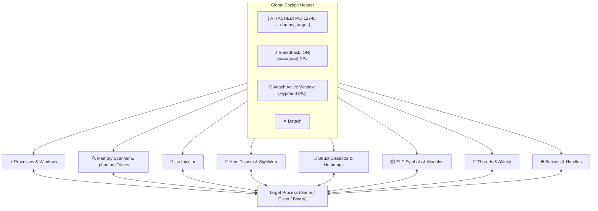

# PhantomSuite v3.0: Complete Visual Field Guide

Welcome to **PhantomSuite v3.0** — your native Linux reverse-engineering workbench, memory scanner, struct dissector, and process instrumentation cockpit. This guide breaks down each of the 8 core tabs, how they communicate with the Linux kernel, and how to execute key workflows.

---

## Architecture Overview & HUD Bar



### The Global Header
No matter which tab you're on, the top bar provides persistent situational awareness:
* **Target Badge**: Displays the currently attached PID, process binary name, and window title.
* **⚡ Speedhack Engine**: In-header speed slider (`0.2x` bullet time to `5.0x` fast-forward) controlling process time dilation via `/dev/shm` shared memory hooks.
* **🎯 Attach Active Window**: Instantly queries Hyprland's IPC socket (`hyprctl activewindow -j`). Switch to your game or app, switch back, hit this button, and you are attached in 1 click without searching.
* **Yama ptrace Indicator**: Located in the bottom-right status bar. Displays green (`ptrace_scope: 0`) for unrestricted memory access, or amber if elevated `pkexec` escalation is needed.

---

## Tab 1: ⚡ Processes & Windows

The **mission control** for discovering and managing system targets.

```
┌────────────────────────────────────────────────────────────────────────────────────────┐
│ Search: [ Filter by PID, name, title...      ] [ Hyprland Windows Only ▼ ] [ ⟳ Refresh ]│
├─────────┬──────────────────────┬────────────────────────┬───────────┬────────┬─────────┤
│ PID     │ Name                 │ Window Title / Class   │ RSS (MB)  │ User   │ State   │
├─────────┼──────────────────────┼────────────────────────┼───────────┼────────┼─────────┤
│ 58959   │ 🪟 brave-browser     │ Chat — Muse [brave]    │ 428.0 MB  │ eve    │ S       │
│ 9451    │ 🪟 discord           │ @Demon - Discord       │ 291.5 MB  │ eve    │ S       │
│ 73729   │ dummy_target         │                        │ 1.2 MB    │ eve    │ S       │
└─────────┴──────────────────────┴────────────────────────┴───────────┴────────┴─────────┘
  [ 🎯 Attach Selected ]               [ ⏸ Pause ] [ ▶ Resume ] [ ✖ Terminate ] [ ⚡ Kill ]
```

### Key Capabilities
1. **Hyprland Window Detection**:
   - Cyan entries marked with `🪟` denote graphical desktop windows.
   - Shows both the human-readable window title and the Wayland window class.
2. **Filter Modes**:
   - **All Visible Processes**: Full system-wide process tree from `/proc`.
   - **Hyprland Windows Only**: Filters out daemons and CLI background tasks to show only your open apps and games.
   - **My User Processes Only**: Hides root and system services to keep the list clean.
3. **Hardware Process Controls (Kernel Signals)**:
   - **⏸ Pause (SIGSTOP)**: Freezes the target in memory. The process completely stops executing cycles (ideal for halting games or preventing timer expirations while scanning).
   - **▶ Resume (SIGCONT)**: Wakes up a frozen process so it resumes running normally.
   - **✖ Terminate (SIGTERM)** / **⚡ Kill (SIGKILL)**: Graceful exit vs force-kill.

---

## Tab 2: 🔍 Memory Scanner, Value Freezer & .phantom Tables

The **Cheat Engine** core of PhantomSuite. Scan, filter, lock values, and export cheat tables that survive game restarts.

```
┌────────────────────────────────────────────────────────────────────────────────────────┐
│ Scan Configuration: Value: [ 1337   ] Type: [ 4 Bytes (int32) ▼ ] Scan: [ Exact ▼ ]   │
│ [✓] Writable Memory Only (rw-p)       [ ⚡ First Scan ] [ 🔍 Next Scan ] [ ⟳ New Scan ]│
├────────────────────────────────────────────────────────────────────────────────────────┤
│ Scan Results:                                                                          │
│ Address             Value              Previous                                        │
│ 0x55AFC0A4A084      1337               -                                               │
├────────────────────────────────────────────────────────────────────────────────────────┤
│ Saved Address Table & Value Freezer                                                    │
│ Active │ Description   │ Address         │ Type    │ Value                             │
│ [✓]    │ Score         │ 0x55AFC0A4A084  │ int32   │ 1337                              │
│ [ ]    │ Ptr: Player   │ 0x55AFC0A4A090  │ int32   │ 100                               │
└────────┴───────────────┴─────────────────┴─────────┴───────────────────────────────────┘
  [ + Add Custom ] [ ✏ Change Value ] [ 🗑 Remove ] [ 🔍 Pointer Scan ]   [ 💾 Save Table ] [ 📂 Load Table ]
```

### 💾 Save & 📂 Load Tables (`.phantom`)
* **ASLR-Resilient**: Saves addresses relative to their loaded base module (e.g. `dummy_target + 0x4084`). When loading into a newly launched game instance where ASLR shifted memory, PhantomSuite dynamically calculates `current_module_base + offset`.
* **Zero Configuration**: Exports all active freeze states, descriptions, and custom notes in standard JSON format.

### 🔍 Multi-Level Pointer Scanner
* Dynamically allocated heap variables change address every restart.
* Highlight any address and click **🔍 Pointer Scan**. PhantomSuite crawls memory to find static pointer chains:
  `[module_name + base_offset] -> offset_1 -> offset_2 -> Target Address`
* Click **Add to Address Table** to save the pointer path!

### ✨ AOB Pattern Scanning
* Select **AOB / Pattern (with ??)** in the Type combobox.
* Enter a byte signature with wildcards (e.g. `48 89 5C ?? ?? 48 83 EC *`).
* Scans all mapped memory regions instantly and lists matching base addresses.

---

## Tab 3: 💉 .so Injector & Loaded Modules

Load and unload compiled shared libraries (`.so`) into any running process using GDB's runtime dynamic linker.

```
┌────────────────────────────────────────────────────────────────────────────────────────┐
│ Payload Injection (.so)                                                                │
│ Shared Object: [ /home/eve/Projects/PhantomSuite/examples/hello_payload.so ] [Browse]  │
│                                            [ 💉 Inject Payload ]  [ ⏏ Unload Selected ]│
├────────────────────────────────────────────────────────────────────────────────────────┤
│ Loaded Dynamic Modules & Libraries (PID 73729)                                         │
│ [ Filter loaded modules...                                         ] [ ⟳ Refresh ]     │
├─────────────────────────┬──────────────────────┬──────────┬────────────────────────────┤
│ Module Name             │ Base Address         │ Perms    │ Full Path                  │
├─────────────────────────┼──────────────────────┼──────────┼────────────────────────────┤
│ hello_payload.so        │ 0x7F2B3C000000       │ r-xp     │ .../examples/hello_payload.so
│ speedhack.so            │ 0x7F2B3BE00000       │ r-xp     │ .../payloads/speedhack.so  │
│ libc.so.6               │ 0x7F2B3C200000       │ r-xp     │ /usr/lib/libc.so.6         │
└─────────────────────────┴──────────────────────┴──────────┴────────────────────────────┘
```

---

## Tab 4: 🧬 Hex, Disasm & Automatic SigMaker

Dual-pane low-level inspection: raw memory bytes on top, live x86_64 assembly instructions on bottom.

```
┌────────────────────────────────────────────────────────────────────────────────────────┐
│ Address: [ 0x55AFC0A49000 ] [ Go ] [ ◀ Prev ] [ Next ▶ ] [✓] Live Auto-Refresh [Patch] │
├────────────────────────────────────────────────────────────────────────────────────────┤
│ Raw Memory Hex View:                                                                   │
│ Address              Bytes (0-7)              Bytes (8-F)              ASCII           │
│ 0x000055AFC0A49000   F3 0F 1E FA 48 83 EC 08  48 8B 05 C1 2F 00 00     ....H...H.../...│
├────────────────────────────────────────────────────────────────────────────────────────┤
│ Live x86_64 Disassembly & Code Patcher:                                                │
│ Address         Hex Bytes        Instruction                           Status          │
│ 0x55AFC0A49000  f3 0f 1e fa      endbr64                               Active          │
│ 0x55AFC0A49004  90 90 90 90      nop                                   NOPed           │
│ 0x55AFC0A49008  48 8b 05 c1...   mov rax, QWORD PTR [rip+0x2fc1]       Active          │
└────────────────────────────────────────────────────────────────────────────────────────┘
  [ ✨ SigMaker (AOB Sig) ]   [ 🚫 Replace with NOPs (0x90) ]   [ ↺ Restore Original ]
```

### 1-Click Code NOPing
* Highlight any subtraction instruction (e.g. `sub dword ptr [rax], 1` or `dec [rbp-4]`).
* Click **🚫 Replace with NOPs (0x90)**: PhantomSuite overwrites the opcode with NOP bytes so the code never decrements your value.
* Click **↺ Restore Original**: Restores the original cached machine code instantly.

### ✨ Automated SigMaker
* Select any instruction in the table and click **✨ SigMaker (AOB Sig)**.
* PhantomSuite computes the shortest unique byte sequence in the module that identifies that instruction.
* Opens a dialog displaying the AOB pattern, length, and a 1-click **📋 Copy Signature** button.

---

## Tab 5: 🔬 Struct Dissector & Live Heatmap Data Analyzer

Inspect heap-allocated structs, entity components, and C++ objects in real time.

```
┌────────────────────────────────────────────────────────────────────────────────────────┐
│ Base Address: [ 0x55AFC0A4A080 ] Size: [ 256 Bytes ▼ ] Stride: [ 4 Bytes ▼ ] [🔬 Dissect]
│ [✓] 🔥 Live Heatmap (300ms)               [ 📄 Export C Struct ] [ ⬇ Add to Table ]    │
├─────────┬──────────────────────┬────────────┬──────────────────┬──────────────┬────────┤
│ Offset  │ Address              │ Field Name │ Suggested Type   │ Value        │ Heatmap│
├─────────┼──────────────────────┼────────────┼──────────────────┼──────────────┼────────┤
│ +0x000  │ 0x55AFC0A4A080       │ health     │ 4 Bytes (int32)  │ 100          │ -      │
│ +0x004  │ 0x55AFC0A4A084       │ score      │ 4 Bytes (int32)  │ 1337         │ ● DIFF │
│ +0x008  │ 0x55AFC0A4A088       │ speed      │ Float            │ 4.500000     │ -      │
│ +0x010  │ 0x55AFC0A4A090       │ ptr_next   │ Pointer (ptr64)  │ 0x7F2B3C...  │ -      │
└─────────┴──────────────────────┴────────────┴──────────────────┴──────────────┴────────┘
```

### Key Workflows:
1. **🔥 Live Heatmaps**: Turn on Live Heatmap. In game, move your player or take damage. Fluctuating coordinates or changing health will glow with **● DIFF** in neon magenta!
2. **Rename Fields**: Double-click any field name to rename it (e.g. change `field_0x04` to `player_gold`).
3. **📄 Export C Struct**: Generates a drop-in C/C++ struct header definition for game modding or tool development.
4. **⬇ Add to Address Table**: Select fields and send them straight into the Cheat Table.

---

## Tab 6: 📦 ELF Symbol & Module Explorer

Explore symbols, functions, global variables, and sections directly from loaded executables and `.so` libraries.

```
┌────────────────────────────────────────────────────────────────────────────────────────┐
│ Module: [ dummy_target (0x55AFC0A49000) ▼ ] [ ⟳ ] Filter: [ health  ] Type: [ All ▼ ]  │
│ [ 🔬 Disassemble ]   [ ⬇ Add to Table ]   [ 📋 Copy Addr ]                             │
├─────────────────────────────┬────────┬─────────────┬─────────────────┬──────┬──────────┤
│ Symbol Name                 │ Type   │ File Offset │ Runtime Address │ Size │ Status   │
├─────────────────────────────┼────────┼─────────────┼─────────────────┼──────┼──────────┤
│ target_health               │ OBJECT │ 0x4080      │ 0x55AFC0A4A080  │ 4    │ Exported │
│ target_score                │ OBJECT │ 0x4084      │ 0x55AFC0A4A084  │ 4    │ Exported │
│ target_speed                │ OBJECT │ 0x4088      │ 0x55AFC0A4A088  │ 4    │ Exported │
│ main                        │ FUNC   │ 0x11E9      │ 0x55AFC0A491E9  │ 193  │ Exported │
└─────────────────────────────┴────────┴─────────────┴─────────────────┴──────┴──────────┘
```

### Key Workflows:
1. **Instant Function & Variable Finding**: Type `health`, `gold`, `score`, or `render` in the filter box.
2. **🔬 1-Click Disassembly**: Select a function symbol and click **🔬 Disassemble** (or double-click) to jump directly into the live disassembler at that instruction!
3. **⬇ Add to Address Table**: Directly creates a named cheat table entry with runtime address and type.

---

## Tab 7: 🧵 Threads & CPU Core Affinity

Inspect and manage individual thread tasks under `/proc/<pid>/task/`.

```
┌────────────────────────────────────────────────────────────────────────────────────────┐
│ [ Filter threads by TID or name...                         ] [ ⟳ Refresh Threads ]     │
├───────┬──────────────────────┬───────┬──────┬─────────────────┬────────────────────────┤
│ TID   │ Thread Name          │ State │ Core │ CPU Time (u/s)  │ Affinity Cores         │
├───────┼──────────────────────┼───────┼──────┼─────────────────┼────────────────────────┤
│ 79059 │ dummy_target         │ S     │ 2    │ 0.12s / 0.04s   │ 16 cores               │
│ 79061 │ audio_thread         │ R     │ 4    │ 1.45s / 0.22s   │ 16 cores               │
│ 79062 │ network_worker       │ S     │ 0    │ 0.35s / 0.10s   │ [0, 1]                 │
└───────┴──────────────────────┴───────┴──────┴─────────────────┴────────────────────────┘
  [ ⏸ Pause Thread (SIGSTOP) ]   [ ▶ Resume Thread (SIGCONT) ]   [ ⚙ Set CPU Affinity ]
```

### Targeted Thread Freezing & Core Pinning
* **Pause specific threads (`libc.tgkill`)**: Freeze an annoying background timer or network sync thread without pausing rendering.
* **CPU Core Pinning (`sched_setaffinity`)**: Pin audio or game threads to high-performance cores (e.g. Core 0 or 2) to eliminate micro-stutters.

---

## Tab 8: 🌐 Sockets & Handles

Inspect every open file descriptor, network socket, IPC pipe, and device file.

```
┌────────────────────────────────────────────────────────────────────────────────────────┐
│ Filter Handles: [ Search path, port, IP... ] [ Sockets (Network / IPC) ▼ ] [ ⟳ Refresh]│
├──────┬──────────┬───────────────────────────────┬──────────────────────────────────────┤
│ FD   │ Type     │ Target / Inode                │ Details                              │
├──────┼──────────┼───────────────────────────────┼──────────────────────────────────────┤
│ 3    │ SOCKET   │ socket:[1999106]              │ TCP 0.0.0.0:19876 -> 0.0.0.0:0 [LISTEN]
│ 4    │ SOCKET   │ socket:[2001452]              │ TCP 192.168.1.15:44321 -> 140.82.114.3:443 [ESTABLISHED]
│ 1    │ PIPE     │ pipe:[1996587]                │ IPC FIFO                             │
│ 6    │ FILE     │ /home/eve/.config/app/save.dat│ Size: 48,120 bytes                   │
└──────┴──────────┴───────────────────────────────┴──────────────────────────────────────┤
```

---

## Quick Reference Summary

| Tab | Best For | Superpower |
| :--- | :--- | :--- |
| **⚡ Processes & Windows** | Finding & controlling targets | 1-click active Hyprland window attach & SIGSTOP freeze |
| **🔍 Memory Scanner** | Finding variables & cheats | Gigabyte/s scan speed, 50ms active freeze, AOB patterns, .phantom tables |
| **💉 .so Injector** | Code injection | GDB dlopen with /proc maps verification & dlclose unloader |
| **🧬 Hex & Disasm** | Byte & opcode inspection | Live 500ms auto-refresh, 1-click NOP patcher & **✨ SigMaker** |
| **🔬 Struct Dissector** | Entity & class inspection | **🔥 Live heatmaps**, heuristic pointer/float detection, C struct exporter |
| **📦 ELF Symbols** | Static & dynamic symbol lookup | Demangled C++ symbols, runtime address resolution, 1-click disasm jump |
| **🧵 Threads** | Thread-level analysis | Per-thread pause/resume (tgkill) and CPU core pinning |
| **🌐 Sockets & Handles** | File & network auditing | Kernel socket inode to IP:port resolution |
| **⚡ Speedhack (HUD)** | Time dilation | In-header slider from 0.2x bullet-time to 5.0x fast-forward |
