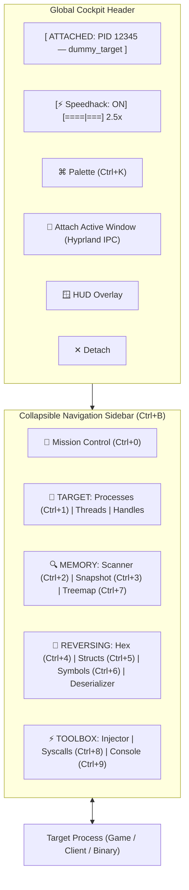

# PhantomSuite: Complete Visual Field Guide

Welcome to **PhantomSuite** — your native Linux reverse-engineering workbench, memory scanner, struct dissector, and process instrumentation cockpit. This guide breaks down the overhauled ergonomic layout, the modern collapsible navigation sidebar, the fuzzy command palette, each of the 13 core tools, and the Mission Control dashboard.

---

## Architecture Overview & Cockpit HUD



### The Global Header
No matter which tool you're using, the top bar provides persistent situational awareness:
* **Target Badge**: Displays the currently attached PID, process binary name, and window title.
* **⚡ Speedhack Engine**: In-header speed slider (`0.2x` bullet time to `5.0x` fast-forward) controlling process time dilation via `/dev/shm` shared memory hooks.
* **⌘ Command Palette (`Ctrl+K` / `Ctrl+P`)**: Global fuzzy launcher for all tabs, tools, quick actions, and direct memory address jumping.
* **🎯 Attach Active Window**: Instantly queries Hyprland's IPC socket (`hyprctl activewindow -j`). Switch to your game or app, switch back, hit this button, and you are attached in 1 click without searching.
* **🪟 HUD Overlay**: Toggles the floating, semi-transparent On-Screen Display HUD above all windows.
* **Yama ptrace Indicator**: Located in the bottom-right status bar. Displays green (`ptrace_scope: 0`) for unrestricted memory access, or amber if elevated `pkexec` escalation is needed.

---

## 🚀 Mission Control Dashboard (`Ctrl+0`)

The default landing page for quick launching workflows and re-attaching to past sessions.

```
┌────────────────────────────────────────────────────────────────────────────────────────┐
│ PHANTOMSUITE // MISSION CONTROL                                                        │
│ High-Performance Native Linux Reverse Engineering, Memory Scanner & Process Workbench │
├──────────────────────────────────────────┬─────────────────────────────────────────────┤
│ 🎯 Attach Active Window                  │ ⚡ Process Explorer                         │
│ Auto-detect and attach to focused window │ Search through system processes & windows   │
├──────────────────────────────────────────┼─────────────────────────────────────────────┤
│ 📂 Load Saved Cheat Table                │ 🐍 Python Scripting Console                 │
│ Open an ASLR-resilient .phantom table    │ Interactive memory reading & batch scripts  │
├──────────────────────────────────────────┴─────────────────────────────────────────────┤
│ RECENT TARGETS                                                        [ Clear History ]│
│ ⚡ [73729] dummy_target  — /home/eve/Projects/PhantomSuite/tests/target (2026-09-27)   │
│ ⚡ [9451]  discord       — /usr/bin/discord                            (2026-09-27)   │
└────────────────────────────────────────────────────────────────────────────────────────┘
```

---

## ⌘ The Command Palette (`Ctrl+K` / `Ctrl+P`)

Press **Ctrl+K** or **Ctrl+P** anywhere in the application to open the floating command palette:

* **Instant Tool Switching**: Type `scan`, `hex`, `snap`, `struct`, `sym`, `sys`, `proc` to jump straight to any tool.
* **Quick Actions**:
  * Type `attach` → Attaches to currently focused Hyprland window.
  * Type `speed` → Adjusts speedhack multiplier or toggles it ON/OFF.
  * Type `pause` or `freeze` → Sends `SIGSTOP` to halt the process.
  * Type `snap` → Triggers Snapshot A or Snapshot B capture.
  * Type `hud` → Toggles floating translucent in-game OSD.
* **Direct Address Jumping**:
  * Type any hex address (e.g. `0x55AFC0A4A080`) or integer:
  * Select `🧬 Jump to Hex Editor at 0x...` or `🔬 Dissect Struct at 0x...` to jump straight there!

---

## Tab 1: ⚡ Processes & Windows

The **mission control** for discovering and managing system targets.

```
┌────────────────────────────────────────────────────────────────────────────────────────┐
│ Search: [ Filter by PID, name, title...      ] [ Hyprland Windows Only ▼ ] [ ⟳ Refresh ]│
├─────────┬──────────────────────┬────────────────────────┬───────────┬────────┬─────────┤
│ PID     │ Name                 │ Window Title / Class   │ RSS (MB)  │ User   │ State   │
├─────────┼──────────────────────┼────────────────────────┼───────────┼────────┼─────────┤
│ 58959   │ 🪟 brave-browser     │ Chat — Muse [brave]    │ 428.0 MB  │ eve    │ S       │
│ 9451    │ 🪟 discord           │ @Demon - Discord       │ 291.5 MB  │ eve    │ S       │
│ 73729   │ dummy_target         │                        │ 1.2 MB    │ eve    │ S       │
└─────────┴──────────────────────┴────────────────────────┴───────────┴────────┴─────────┘
  [ 🎯 Attach Selected ]               [ ⏸ Pause ] [ ▶ Resume ] [ ✖ Terminate ] [ ⚡ Kill ]
```

### Key Capabilities
1. **Hyprland Window Detection**:
   - Cyan entries marked with `🪟` denote graphical desktop windows.
   - Shows both the human-readable window title and the Wayland window class.
2. **Filter Modes**:
   - **All Visible Processes**: Full system-wide process tree from `/proc`.
   - **Hyprland Windows Only**: Filters out daemons and CLI background tasks to show only your open apps and games.
   - **My User Processes Only**: Hides root and system services to keep the list clean.
3. **Hardware Process Controls (Kernel Signals)**:
   - **⏸ Pause (SIGSTOP)**: Freezes the target in memory. The process completely stops executing cycles (ideal for halting games or preventing timer expirations while scanning).
   - **▶ Resume (SIGCONT)**: Wakes up a frozen process so it resumes running normally.
   - **✖ Terminate (SIGTERM)** / **⚡ Kill (SIGKILL)**: Graceful exit vs force-kill.

---

## Tab 2: 🔍 Memory Scanner, Value Freezer & .phantom Tables

The **Cheat Engine** core of PhantomSuite. Scan, filter, lock values, and export cheat tables that survive game restarts.

```
┌────────────────────────────────────────────────────────────────────────────────────────┐
│ Scan Configuration: Value: [ 1337   ] Type: [ 4 Bytes (int32) ▼ ] Scan: [ Exact ▼ ]   │
│ [✓] Writable Memory Only (rw-p)       [ ⚡ First Scan ] [ 🔍 Next Scan ] [ ⟳ New Scan ]│
├────────────────────────────────────────────────────────────────────────────────────────┤
│ Scan Results:                                                                          │
│ Address             Value              Previous                                        │
│ 0x55AFC0A4A084      1337               -                                               │
├────────────────────────────────────────────────────────────────────────────────────────┤
│ Saved Address Table & Value Freezer                                                    │
│ Active │ Description   │ Address         │ Type    │ Value                             │
│ [✓]    │ Score         │ 0x55AFC0A4A084  │ int32   │ 1337                              │
│ [ ]    │ Ptr: Player   │ 0x55AFC0A4A090  │ int32   │ 100                               │
└────────┴───────────────┴─────────────────┴─────────┴───────────────────────────────────┘
  [ + Add Custom ] [ ✏ Change Value ] [ 🎯 Find What Writes ] [ 🔍 Pointer Scan ] [ 💾 Save ] [ 📂 Load ]
```

### 💾 Save & 📂 Load Tables (`.phantom`)
* **ASLR-Resilient**: Saves addresses relative to their loaded base module (e.g. `dummy_target + 0x4084`). When loading into a newly launched game instance where ASLR shifted memory, PhantomSuite dynamically calculates `current_module_base + offset`.
* **Zero Configuration**: Exports all active freeze states, descriptions, and custom notes in standard JSON format.

### 🔍 Multi-Level Pointer Scanner
* Highlight any address and click **🔍 Pointer Scan**. PhantomSuite crawls memory to find static pointer chains:
  `[module_name + base_offset] -> offset_1 -> offset_2 -> Target Address`
* Click **Add to Address Table** to save the pointer path!

### 🎯 Find What Writes
* Highlight any found address or saved cheat entry and click **🎯 Find What Writes**.
* Spawns the hardware watchpoint tracer to trap CPU instructions writing to that address.

---

## Tab 3: 📸 Snapshot Diff (Full-Process Differential Memory)

Capture full-memory dumps of all writable memory (`rw-p`) and compute differential deltas across state changes.

```
┌────────────────────────────────────────────────────────────────────────────────────────┐
│ [ 📸 Take Snapshot A ]  [ 📸 Take Snapshot B ]  Filter: [ Increased ▼ ] [ Noise Filter: ON ]│
├────────────────────────────────────────────────────────────────────────────────────────┤
│ Address         Module / Region       Old (int32)    New (int32)    Delta     Hex Diff │
├────────────────────────────────────────────────────────────────────────────────────────┤
│ 0x55AFC0A4A080  dummy_target + 0x4080 100            250            +150      64 -> FA │
│ 0x7F2B3C104200  [heap] + 0x2200       12             18             +6        0C -> 12 │
└────────────────────────────────────────────────────────────────────────────────────────┘
  [ ⬇ Send to Cheat Table ]   [ 🧬 View in Hex ]   [ 💾 Export CSV ]
```

### Key Workflows:
1. **Zero-Knowledge Unknown Value Finding**: When you don't know the exact value (e.g., hidden XP, cooldowns, combo meters), take **Snapshot A**.
2. Perform an action in-game (attack, earn points, take damage).
3. Take **Snapshot B** and filter by `Increased`, `Decreased`, or `Changed`.
4. Double-click or click **⬇ Send to Cheat Table** to immediately track or freeze the variable.

---

## Tab 4: 💉 .so Injector & Loaded Modules

Load and unload compiled shared libraries (`.so`) into any running process using GDB's runtime dynamic linker.

```
┌────────────────────────────────────────────────────────────────────────────────────────┐
│ Payload Injection (.so)                                                                │
│ Shared Object: [ /home/eve/Projects/PhantomSuite/examples/hello_payload.so ] [Browse]  │
│                                            [ 💉 Inject Payload ]  [ ⏏ Unload Selected ]│
├────────────────────────────────────────────────────────────────────────────────────────┤
│ Loaded Dynamic Modules & Libraries (PID 73729)                                         │
│ [ Filter loaded modules...                                         ] [ ⟳ Refresh ]     │
├─────────────────────────┬──────────────────────┬──────────┬────────────────────────────┤
│ Module Name             │ Base Address         │ Perms    │ Full Path                  │
├─────────────────────────┼──────────────────────┼──────────┼────────────────────────────┤
│ hello_payload.so        │ 0x7F2B3C000000       │ r-xp     │ .../examples/hello_payload.so
│ speedhack.so            │ 0x7F2B3BE00000       │ r-xp     │ .../payloads/speedhack.so  │
│ libc.so.6               │ 0x7F2B3C200000       │ r-xp     │ /usr/lib/libc.so.6         │
└─────────────────────────┴──────────────────────┴──────────┴────────────────────────────┘
```

---

## Tab 5: 🧬 Hex, Disasm & Automatic SigMaker

Dual-pane low-level inspection: raw memory bytes on top, live x86_64 assembly instructions on bottom.

```
┌────────────────────────────────────────────────────────────────────────────────────────┐
│ Address: [ 0x55AFC0A49000 ] [ Go ] [ ◀ Prev ] [ Next ▶ ] [✓] Live Auto-Refresh [Patch] │
├────────────────────────────────────────────────────────────────────────────────────────┤
│ Raw Memory Hex View:                                                                   │
│ Address              Bytes (0-7)              Bytes (8-F)              ASCII           │
│ 0x000055AFC0A49000   F3 0F 1E FA 48 83 EC 08  48 8B 05 C1 2F 00 00     ....H...H.../...│
├────────────────────────────────────────────────────────────────────────────────────────┤
│ Live x86_64 Disassembly & Code Patcher:                                                │
│ Address         Hex Bytes        Instruction                           Status          │
│ 0x55AFC0A49000  f3 0f 1e fa      endbr64                               Active          │
│ 0x55AFC0A49004  90 90 90 90      nop                                   NOPed           │
│ 0x55AFC0A49008  48 8b 05 c1...   mov rax, QWORD PTR [rip+0x2fc1]       Active          │
└────────────────────────────────────────────────────────────────────────────────────────┘
  [ 🎯 Watchpoint (Find Writers) ] [ ✨ SigMaker (AOB Sig) ] [ 🚫 Replace with NOPs ] [ ↺ Restore ]
```

### 1-Click Code NOPing
* Highlight any subtraction instruction (e.g. `sub dword ptr [rax], 1` or `dec [rbp-4]`).
* Click **🚫 Replace with NOPs (0x90)**: Overwrites the opcode with NOP bytes so code never decrements your value.
* Click **↺ Restore Original**: Restores original cached machine code instantly.

### ✨ Automated SigMaker
* Select any instruction in the table and click **✨ SigMaker (AOB Sig)** to compute the shortest unique byte sequence.

---

## Tab 6: 🔬 Struct Dissector & Live Heatmap Data Analyzer

Inspect heap-allocated structs, entity components, and C++ objects in real time.

```
┌────────────────────────────────────────────────────────────────────────────────────────┐
│ Base Address: [ 0x55AFC0A4A080 ] Size: [ 256 Bytes ▼ ] Stride: [ 4 Bytes ▼ ] [🔬 Dissect]
│ [✓] 🔥 Live Heatmap (300ms)               [ 📄 Export C Struct ] [ ⬇ Add to Table ]    │
├─────────┬──────────────────────┬────────────┬──────────────────┬──────────────┬────────┤
│ Offset  │ Address              │ Field Name │ Suggested Type   │ Value        │ Heatmap│
├─────────┼──────────────────────┼────────────┼──────────────────┼──────────────┼────────┤
│ +0x000  │ 0x55AFC0A4A080       │ health     │ 4 Bytes (int32)  │ 100          │ -      │
│ +0x004  │ 0x55AFC0A4A084       │ score      │ 4 Bytes (int32)  │ 1337         │ ● DIFF │
│ +0x008  │ 0x55AFC0A4A088       │ speed      │ Float            │ 4.500000     │ -      │
│ +0x010  │ 0x55AFC0A4A090       │ ptr_next   │ Pointer (ptr64)  │ 0x7F2B3C...  │ -      │
└─────────┴──────────────────────┴────────────┴──────────────────┴──────────────┴────────┘
```

---

## Tab 7: 📦 ELF Symbol & Module Explorer

Explore symbols, functions, global variables, and sections directly from loaded executables and `.so` libraries.

```
┌────────────────────────────────────────────────────────────────────────────────────────┐
│ Module: [ dummy_target (0x55AFC0A49000) ▼ ] [ ⟳ ] Filter: [ health  ] Type: [ All ▼ ]  │
│ [ 🔬 Disassemble ]   [ ⬇ Add to Table ]   [ 📋 Copy Addr ]                             │
├─────────────────────────────┬────────┬─────────────┬─────────────────┬──────┬──────────┤
│ Symbol Name                 │ Type   │ File Offset │ Runtime Address │ Size │ Status   │
├─────────────────────────────┼────────┼─────────────┼─────────────────┼──────┼──────────┤
│ target_health               │ OBJECT │ 0x4080      │ 0x55AFC0A4A080  │ 4    │ Exported │
│ target_score                │ OBJECT │ 0x4084      │ 0x55AFC0A4A084  │ 4    │ Exported │
│ main                        │ FUNC   │ 0x11E9      │ 0x55AFC0A491E9  │ 193  │ Exported │
└─────────────────────────────┴────────┴─────────────┴─────────────────┴──────┴──────────┘
```

---

## Tab 8: 🗺️ Memory Map Visualizer & Segment Treemap

A visual proportional memory distribution bar and segment browser for `/proc/<pid>/maps`.

```
┌────────────────────────────────────────────────────────────────────────────────────────┐
│ [████ Heap: 14.2 MB ████][██ Stack: 132 KB █][██ Libs: 34.5 MB ██][ Anonymous: 8.0 MB ]│
├───────────────────┬───────────────────┬───────────────────┬────────────────────────────┤
│ TOTAL VIRT: 58 MB │ RSS: 12.4 MB      │ WRITABLE: 18.2 MB │ SEGMENTS: 42               │
├───────────────────┴───────────────────┴───────────────────┴────────────────────────────┤
│ Segment Address Range     Perms   Size      Offset    Device   Path / Mapping          │
├───────────────────────────┼───────┼─────────┼─────────┼────────┼───────────────────────┤
│ 0x55AFC0A49000-0x55AFC... │ r-xp  │ 16 KB   │ 0x0000  │ 00:1d  │ /usr/bin/dummy_target │
│ 0x55AFC0A4D000-0x55AFC... │ rw-p  │ 8 KB    │ 0x3000  │ 00:1d  │ /usr/bin/dummy_target │
│ 0x7F2B3C000000-0x7F2B3... │ rw-p  │ 14.2 MB │ 0x0000  │ 00:00  │ [heap]                │
└───────────────────────────┴───────┴─────────┴─────────┴────────┴───────────────────────┘
  [ 🧬 View in Hex ]   [ 🔬 Dissect Struct ]   [ ⟳ Refresh Map ]
```

---

## Tab 9: 📡 Real-Time Syscall Telemetry Monitor ("GUI strace")

Streaming kernel system call telemetry monitor with classification and export.

```
┌────────────────────────────────────────────────────────────────────────────────────────┐
│ [ ▶ Start Tracing ] [ ⏹ Stop ] [ 🗑 Clear ] [ 💾 Export CSV ]  Filter: [ recvfrom    ]   │
├──────────────┬───────┬────────────┬─────────────────────────────┬────────┬─────────────┤
│ Timestamp    │ PID   │ Syscall    │ Arguments                   │ Return │ Duration    │
├──────────────┼───────┼────────────┼─────────────────────────────┼────────┼─────────────┤
│ 15:42:01.120 │ 73729 │ read       │ fd=3, buf=0x7ffd..., len=64 │ 64     │ 14 µs       │
│ 15:42:01.121 │ 73729 │ write      │ fd=1, buf="[TARGET]...", 24 │ 24     │ 8 µs        │
│ 15:42:01.220 │ 73729 │ nanosleep  │ {tv_sec=0, tv_nsec=100000}  │ 0      │ 100042 µs   │
└──────────────┴───────┴────────────┴─────────────────────────────┴────────┴─────────────┘
```

* **Color Categories**:
  - `FILE` (Green): `open`, `read`, `write`, `close`
  - `NET` (Cyan): `socket`, `connect`, `send`, `recv`, `bind`
  - `MEM` (Magenta): `mmap`, `mprotect`, `brk`
  - `PROC` (Amber): `clone`, `fork`, `execve`, `kill`
  - `IPC` (Purple): `futex`, `pipe`, `epoll_wait`

---

## Tab 10: 🧩 Dynamic Data Deserializer & Type Inferer

Reconstruct high-level C++ standard library structures and structured payloads directly from raw process memory.

```
┌────────────────────────────────────────────────────────────────────────────────────────┐
│ Address: [ 0x55AFC0A4A080 ] [ 🧩 Decode std::string ] [ 🧩 Decode std::vector ]         │
│ Search Size: [ 4096 ]       [ 🔍 Scan Embedded JSON ] [ 📜 Decode String Table ]       │
├────────────────────────────────────────────────────────────────────────────────────────┤
│ Type: std::string (SSO) | Length: 8 | Capacity: 15 | Buffer: 0x55AFC0A4A090            │
│ Content: "PlayerOne"                                                                   │
└────────────────────────────────────────────────────────────────────────────────────────┘
```

* **`std::string`**: Automatically differentiates between Small String Optimization (SSO, length < 16) and dynamically allocated heap pointers.
* **`std::vector<T>`**: Computes `count` and `capacity` from `_M_start`, `_M_finish`, and `_M_end_of_storage`, and unpacks elements.
* **Embedded JSON**: Scans memory ranges for JSON objects/arrays, validates syntax, and displays formatted trees.
* **String Tables**: Extracts all null-terminated ASCII/UTF-8 strings within a selected buffer.

---

## Tab 11: 🐍 Embedded Python Scripting Console & Plugin Engine

Interactive multi-line Python runtime with full access to PhantomSuite memory APIs and background automation.

```python
# Quick scan & freeze example in Python console
hits = scan("48 8B 05 ?? ?? ?? ?? 48 85 C0")
print(f"Found {len(hits)} signature matches!")

# Read & write variables
current_hp = read_i32(0x55AFC0A4A080)
print(f"Current Health: {current_hp}")
write_i32(0x55AFC0A4A080, 9999)
```

* **Built-in Helpers**: `read()`, `write()`, `read_i32()`, `write_i32()`, `read_float()`, `write_float()`, `scan()`, `disasm()`, `dissect()`, `symbols()`.
* **Templates**: 1-click loading of common patterns:
  - *Dump Memory Range to File*
  - *AOB Pattern Search & Replace*
  - *Resolve Multi-Level Pointer Chain*
  - *Enumerate Loaded Symbols*
* **Plugins**: Drop any `.py` script into `plugins/` to automatically extend PhantomSuite upon launch.

---

## Tab 12: 🧵 Threads & CPU Core Affinity

Inspect and manage individual thread tasks under `/proc/<pid>/task/`.

```
┌────────────────────────────────────────────────────────────────────────────────────────┐
│ [ Filter threads by TID or name...                         ] [ ⟳ Refresh Threads ]     │
├───────┬──────────────────────┬───────┬──────┬─────────────────┬────────────────────────┤
│ TID   │ Thread Name          │ State │ Core │ CPU Time (u/s)  │ Affinity Cores         │
├───────┼──────────────────────┼───────┼──────┼─────────────────┼────────────────────────┤
│ 79059 │ dummy_target         │ S     │ 2    │ 0.12s / 0.04s   │ 16 cores               │
│ 79061 │ audio_thread         │ R     │ 4    │ 1.45s / 0.22s   │ 16 cores               │
│ 79062 │ network_worker       │ S     │ 0    │ 0.35s / 0.10s   │ [0, 1]                 │
└───────┴──────────────────────┴───────┴──────┴─────────────────┴────────────────────────┘
  [ ⏸ Pause Thread (SIGSTOP) ]   [ ▶ Resume Thread (SIGCONT) ]   [ ⚙ Set CPU Affinity ]
```

---

## Tab 13: 🌐 Sockets & Handles

Inspect every open file descriptor, network socket, IPC pipe, and device file.

```
┌────────────────────────────────────────────────────────────────────────────────────────┐
│ Filter Handles: [ Search path, port, IP... ] [ Sockets (Network / IPC) ▼ ] [ ⟳ Refresh]│
├──────┬──────────┬───────────────────────────────┬──────────────────────────────────────┤
│ FD   │ Type     │ Target / Inode                │ Details                              │
├──────┼──────────┼───────────────────────────────┼──────────────────────────────────────┤
│ 3    │ SOCKET   │ socket:[1999106]              │ TCP 0.0.0.0:19876 -> 0.0.0.0:0 [LISTEN]
│ 4    │ SOCKET   │ socket:[2001452]              │ TCP 192.168.1.15:44321 -> 140.82.114.3:443 [ESTABLISHED]
│ 1    │ PIPE     │ pipe:[1996587]                │ IPC FIFO                             │
│ 6    │ FILE     │ /home/eve/.config/app/save.dat│ Size: 48,120 bytes                   │
└──────┴──────────┴───────────────────────────────┴──────────────────────────────────────┤
```

---

## Additional Instruments

### 🎯 Hardware Watchpoints ("Find What Writes / Accesses This Address")
Accessible from the **Memory Scanner** and **Hex Editor**:
1. Highlight any address or byte.
2. Click **🎯 Find What Writes** (or choose watch type: *Write*, *Read*, *Access*).
3. The dialog sets up x86_64 hardware debug registers (`DR0-DR3`).
4. As soon as the game hits the variable, the instruction address (RIP), old value, new value, and disassembled opcode are recorded.
5. Click **🚫 Replace with NOPs** to disable the instruction on the spot!

### 🪟 Wayland / Hyprland On-Screen Display (OSD) Floating HUD
Click **🪟 HUD Overlay** in the main header:
* Spawns an always-on-top, draggable, frameless translucent HUD.
* Monitors pinned cheat table values in real time without obscuring gameplay.
* Displays speedhack status and includes an opacity slider.

---

## Quick Reference Summary (Tools & Shortcuts)

| Tool / Action | Shortcut | Best For | Superpower |
| :--- | :--- | :--- | :--- |
| **🚀 Mission Control** | `Ctrl + 0` | Dashboard & launchpad | Recent target history, 1-click window attach, quick table loading |
| **⌘ Command Palette** | `Ctrl + K` / `Ctrl + P` | Fuzzy navigation & jump | Instant tool switching, actions & hex address jump (`0x...`) |
| **⚡ Processes & Windows** | `Ctrl + 1` | Finding & controlling targets | 1-click active Hyprland window attach & SIGSTOP freeze |
| **🔍 Memory Scanner** | `Ctrl + 2` | Finding variables & cheats | Gigabyte/s scan speed, 50ms active freeze, AOB patterns, .phantom tables |
| **📸 Snapshot Diff** | `Ctrl + 3` | Unknown value & state discovery | Multi-format delta engine with noise filtering |
| **🧬 Hex & Disasm** | `Ctrl + 4` | Byte & opcode inspection | Live 500ms auto-refresh, 1-click NOP patcher & **✨ SigMaker** |
| **🔬 Struct Dissector** | `Ctrl + 5` | Entity & class inspection | **🔥 Live heatmaps**, heuristic pointer/float detection, C struct exporter |
| **📦 ELF Symbols** | `Ctrl + 6` | Static & dynamic symbol lookup | Demangled C++ symbols, runtime address resolution, 1-click disasm jump |
| **🗺️ Memory Map** | `Ctrl + 7` | Visual memory layout | Proportional distribution bar & KPI metric cards |
| **📡 Syscall Telemetry** | `Ctrl + 8` | Kernel monitoring | Live streaming GUI strace with category colors & CSV export |
| **🐍 Scripting Console** | `Ctrl + 9` | Batch memory automation | Python REPL, pre-injected memory APIs, and `plugins/` loader |
| **🧩 Data Deserializer** | — | C++ STL & JSON parsing | Auto-decodes `std::string`, `std::vector`, embedded JSON |
| **💉 .so Injector** | — | Code injection | GDB dlopen with /proc maps verification & dlclose unloader |
| **🧵 Threads** | — | Thread-level analysis | Per-thread pause/resume (tgkill) and CPU core pinning |
| **🌐 Sockets & Handles** | — | File & network auditing | Kernel socket inode to IP:port resolution |
| **◀ Toggle Sidebar** | `Ctrl + B` | Screen real estate | Toggle between 210px expanded view and 54px icon rail |
| **⌨ Shortcuts Cheat Sheet**| `F1` or `?` | Quick help | Opens interactive modal cheat sheet of all hotkeys |
