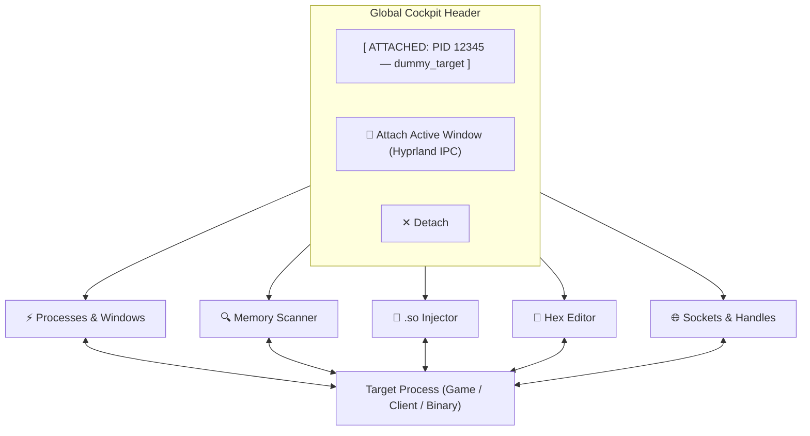
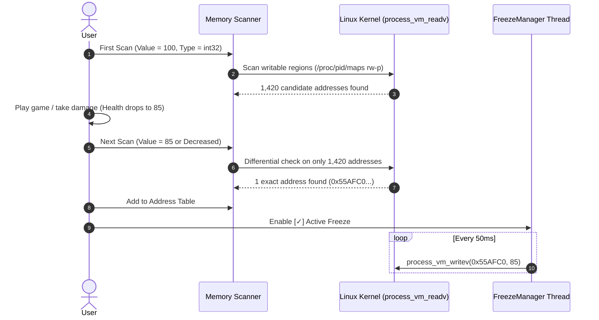

# PhantomSuite: Complete Visual Field Guide

Welcome to **PhantomSuite** — your native Linux reverse-engineering workbench, memory scanner, and process instrumentation cockpit. This guide breaks down each of the 5 core tabs, how they communicate with the Linux kernel, and how to execute key workflows.

---

## Architecture Overview & HUD Bar



### The Global Header
No matter which tab you're on, the top bar provides persistent situational awareness:
* **Target Badge**: Displays the currently attached PID, process binary name, and window title.
* **🎯 Attach Active Window**: Instantly queries Hyprland's IPC socket (`hyprctl activewindow -j`). Switch to your game or app, switch back, hit this button, and you are attached in 1 click without searching.
* **Yama ptrace Indicator**: Located in the bottom-right status bar. Displays green (`ptrace_scope: 0`) for unrestricted memory access, or amber if elevated `pkexec` escalation is needed.

---

## Tab 1: ⚡ Processes & Windows

The **mission control** for discovering and managing system targets.

```
┌────────────────────────────────────────────────────────────────────────────────────────┐
│ Search: [ Filter by PID, name, title...      ] [ Hyprland Windows Only ▼ ] [ ⟳ Refresh ]│
├─────────┬──────────────────────┬────────────────────────┬───────────┬────────┬─────────┤
│ PID     │ Name                 │ Window Title / Class   │ RSS (MB)  │ User   │ State   │
├─────────┼──────────────────────┼────────────────────────┼───────────┼────────┼─────────┤
│ 58959   │ 🪟 brave-browser     │ Chat — Muse [brave]    │ 428.0 MB  │ eve    │ S       │
│ 9451    │ 🪟 discord           │ @Demon - Discord       │ 291.5 MB  │ eve    │ S       │
│ 73729   │ dummy_target         │                        │ 1.2 MB    │ eve    │ S       │
└─────────┴──────────────────────┴────────────────────────┴───────────┴────────┴─────────┘
  [ 🎯 Attach Selected ]               [ ⏸ Pause ] [ ▶ Resume ] [ ✖ Terminate ] [ ⚡ Kill ]
```

### Key Capabilities
1. **Hyprland Window Detection**:
   - Cyan entries marked with `🪟` denote graphical desktop windows.
   - Shows both the human-readable window title and the Wayland window class.
2. **Filter Modes**:
   - **All Visible Processes**: Full system-wide process tree from `/proc`.
   - **Hyprland Windows Only**: Filters out daemons and CLI background tasks to show only your open apps and games.
   - **My User Processes Only**: Hides root and system services to keep the list clean.
3. **Hardware Process Controls (Kernel Signals)**:
   - **⏸ Pause (SIGSTOP)**: Freezes the target in memory. The process completely stops executing cycles (ideal for halting games or preventing timer expirations while scanning).
   - **▶ Resume (SIGCONT)**: Wakes up a frozen process so it resumes running normally.
   - **✖ Terminate (SIGTERM)** / **⚡ Kill (SIGKILL)**: Graceful exit vs force-kill.

### How to Use It
1. Type a name or PID into the search box.
2. Double-click any row (or select it and click **🎯 Attach Selected**).
3. PhantomSuite will bind the target across all other tabs and automatically switch you to the **Memory Scanner**.

---

## Tab 2: 🔍 Memory Scanner & Cheat Table

The **Cheat Engine** core of PhantomSuite. Scan, filter, and lock values in target memory at gigabytes per second.



### Scan Types & When to Use Them

| Scan Type | When to Use It |
| :--- | :--- |
| **Exact Value** | You know the exact number on screen (e.g. Ammo = 30, Gold = 500, Score = 1337). |
| **Increased Value** | You gained health or money, but don't know the exact number. |
| **Decreased Value** | You took damage, spent ammo, or lost resources. |
| **Changed Value** | The value definitely altered, but you don't know if it went up or down. |
| **Unchanged Value** | Eliminates background counters and timer addresses that are constantly ticking. |
| **Bigger / Smaller Than** | Narrow down values within a range (e.g. Health is between 50 and 100). |

### Data Types Supported
* **Integers**: `int32` (most common for game variables), `int64` (pointers, large scores), `int16`, `int8`.
* **Decimals**: `Float` (coordinates, velocity, timers) and `Double`.
* **Text / Strings**: UTF-8 and ASCII string search (e.g. player usernames, item names).
* **Hex Byte Arrays**: Search for instruction opcodes (e.g. `90 90 90` or `89 45 FC`).

### The Address Table & Value Freezer
* **Double-click any scan result** to transfer it down into your saved **Address Table**.
* **Active Checkbox (Freezer)**: Checking this launches a high-frequency background worker thread that continuously rewrites the value every 50ms. If the game tries to decrement your ammo or health, the freezer instantly locks it back.
* **In-Place Value Editing**: Double-click the **Value** column of any saved address to type a new number (e.g., change `100` to `999999`) and press Enter.

---

## Tab 3: 💉 .so Injector & Loaded Modules

Load and unload compiled shared libraries (`.so`) into any running process using GDB's runtime dynamic linker.

```
┌────────────────────────────────────────────────────────────────────────────────────────┐
│ Payload Injection (.so)                                                                │
│ Shared Object: [ /home/eve/Projects/PhantomSuite/examples/hello_payload.so ] [Browse]  │
│                                            [ 💉 Inject Payload ]  [ ⏏ Unload Selected ]│
├────────────────────────────────────────────────────────────────────────────────────────┤
│ Loaded Dynamic Modules & Libraries (PID 73729)                                         │
│ [ Filter loaded modules...                                         ] [ ⟳ Refresh ]     │
├─────────────────────────┬──────────────────────┬──────────┬────────────────────────────┤
│ Module Name             │ Base Address         │ Perms    │ Full Path                  │
├─────────────────────────┼──────────────────────┼──────────┼────────────────────────────┤
│ hello_payload.so        │ 0x7F2B3C000000       │ r-xp     │ .../examples/hello_payload.so
│ libc.so.6               │ 0x7F2B3C200000       │ r-xp     │ /usr/lib/libc.so.6         │
│ ld-linux-x86-64.so.2    │ 0x7F2B3C400000       │ r-xp     │ /usr/lib/ld-linux-x86-64.so│
└─────────────────────────┴──────────────────────┴──────────┴────────────────────────────┘
```

### How Injection Works Under the Hood
1. **Verification**: PhantomSuite confirms the target is a valid dynamically linked 64-bit ELF binary.
2. **GDB Attachment**: GDB attaches to the target thread and executes:
   ```c
   call (void*)dlopen("/path/to/payload.so", RTLD_NOW);
   ```
3. **Map Verification**: The engine reads `/proc/<pid>/maps` to verify that the library was successfully mapped into the target's virtual address space.
4. **Lifecycle Execution**:
   - `__attribute__((constructor))` functions in your C/C++ code execute **immediately** upon injection.
   - `__attribute__((destructor))` functions execute when you hit **⏏ Unload Selected** (`dlclose()`).

---

## Tab 4: 🧬 Hex Editor & Live Patcher

A live, byte-level window into any memory address in the target process.

```
┌────────────────────────────────────────────────────────────────────────────────────────┐
│ Memory Navigation                                                                      │
│ Address: [ 0x55AFC0A4A080 ] [ Go ] [ ◀ Prev ] [ Next ▶ ] [✓] Live Auto-Refresh [Patch] │
├──────────────────────┬─────────────────────────┬─────────────────────────┬─────────────┤
│ Address              │ Bytes (0-7)             │ Bytes (8-F)             │ ASCII       │
├──────────────────────┼─────────────────────────┼─────────────────────────┼─────────────┤
│ 0x000055AFC0A4A080   │ 50 68 61 6E 74 6F 6D 54 │ 61 72 67 65 74 5F 41 63 │ PhantomTarget_Ac
│ 0x000055AFC0A4A090   │ 74 69 76 65 00 00 00 00 │ 39 05 00 00 00 00 00 00 │ tive....9.......
└──────────────────────┴─────────────────────────┴─────────────────────────┴─────────────┘
```

### Key Capabilities
* **Address Jump**: Paste any address found from the Memory Scanner or Loaded Modules tab and hit **Go**.
* **[✓] Live Auto-Refresh**: Updates the hex view every 500ms so you can watch live variables, coordinates, or network buffers fluctuate in real time.
* **✏ Patch Bytes**:
  - Click any row and hit **Patch Bytes**.
  - Type new hex bytes separated by spaces (e.g. `90 90 90` to NOP out code, or `48 41 43 4B` for ASCII text).
  - The engine writes the bytes directly to memory via `process_vm_writev`.

---

## Tab 5: 🌐 Sockets & Handles

Inspect every file descriptor, network connection, IPC pipe, and hardware device opened by the process.

```
┌────────────────────────────────────────────────────────────────────────────────────────┐
│ Filter Handles: [ Search path, port, IP... ] [ Sockets (Network / IPC) ▼ ] [ ⟳ Refresh]│
├──────┬──────────┬───────────────────────────────┬──────────────────────────────────────┤
│ FD   │ Type     │ Target / Inode                │ Details                              │
├──────┼──────────┼───────────────────────────────┼──────────────────────────────────────┤
│ 3    │ SOCKET   │ socket:[1999106]              │ TCP 0.0.0.0:19876 -> 0.0.0.0:0 [LISTEN]
│ 4    │ SOCKET   │ socket:[2001452]              │ TCP 192.168.1.15:44321 -> 140.82.114.3:443 [ESTABLISHED]
│ 0    │ DEVICE   │ /dev/pts/3                    │ Hardware / Virtual Device            │
│ 1    │ PIPE     │ pipe:[1996587]                │ IPC FIFO                             │
│ 6    │ FILE     │ /home/eve/.config/app/save.dat│ Size: 48,120 bytes                   │
└──────┴──────────┴───────────────────────────────┴──────────────────────────────────────┤
```

### Why This is Powerful
* **Spot Hidden Network Connections**: Resolves raw kernel socket inodes to human-readable IP addresses, port numbers, and states (`LISTEN`, `ESTABLISHED`, `CLOSE_WAIT`).
* **Track File Access**: See exactly which configuration files, asset archives, or save games a process has currently locked open.
* **Monitor IPC Pipes**: Inspect inter-process FIFOs and communication channels between multi-process applications (like Electron, Discord, or Steam).

---

## Pro-Tips & Shortcuts

> [!TIP]
> **Hyprland Quick-Attach**:
> While playing a game or using an app in Hyprland, switch to PhantomSuite and immediately click **🎯 Attach Active Window**. It grabs the active Wayland client from `hyprctl activewindow -j` without you ever needing to check `ps` or `/proc`.

> [!TIP]
> **Freezing Values with Cheat Engine Precision**:
> After isolating an address in the Scanner tab, double click it to add it to the bottom table. Once in the bottom table, checking the **Active** box turns on the background 50ms pulse writer. You can double-click the value anytime to modify the locked amount on the fly.

> [!NOTE]
> **Unloading Payloads**:
> If you make code changes to your `.so` payload, you don't need to restart your target app! Simply go to the **.so Injector** tab, find your library in the **Loaded Modules** table, click **⏏ Unload Selected** (`dlclose`), recompile your `.so`, and click **Inject Payload** again.
